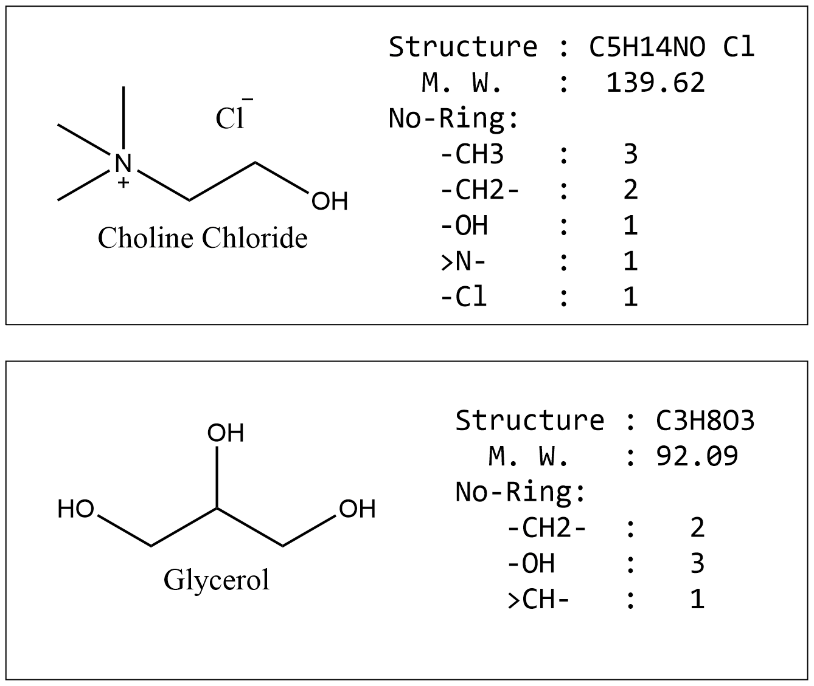

### Modified Lydersen-Joback-Reid Method

*This program calculates critical temperatures necessary to estimate surface tensions of either pure solvents or binary mixtures at elevated temperatures using a modified Lydersen-Joback-Reid Method.*

#### Download
```
git clone git://github.com/orlandoacevedo/mLJR.git
```
Or
```
Download zip file
```


#### Installation
```
pip install mljr

Or

python[3] setup.py install
```

*Note:* Script *mljr.py* is a standalone file, which can be used for updates or modifications.


#### Usage
For helpful information, use
```
mljr
```
or
```
mljr -h
```

```
usage: mljr [-h] [-v] [-f FILE] [-s] [-t] [--CCl] [--CCG] [-g] [-o] [-e] [-x CALC [CALC ...]]

Critical Properties Calculation

Optional arguments:
-h, --help               show this help message and exit
-v, --version            show program's version number and exit
-f FILE, --file FILE     Input file path
-s, --sample             Template shows on screen (default)
-t, --template           Template writes into a file
--CCl                    Template molecule, Choline Chloride <purity> (default)
--CCG                    Template molecule, Choline Chloride Glycerol <mixture>
-g, --avail-group-name
                         Available Group Names <include nick names>
-o, --output             Append results to input file (default False)
-e, --examples           Show command line examples
-x CALC [CALC ...], --calc CALC [CALC ...]
                         If only one input, it will be thought as T, the density
                         value will be calculated, if it has three inputs,
                         which has to be input in a sequence (T-ref, Q-ref, T),
                         then both density and surface tension will be
                         calculated, if else, wrong
```


#### Examples
Free formats. Char < **#** > is used for comments

Note: keyword < name > will be ignored

Note: keyword < M > is precendent of < S >, they both are used to get molecular weight

Note: keyword < S > structrue in a format: (atomType & number) separated by "-" OR blank space 

Note: Case-insensitive, number of "-" or spaces or quotes does not matter

-    Example 1:   C2H3O4N5
-    Example 2:   C2 - H3 - O4 - N5
-    Example 3:   C2   H3   O4   N5
-    Example 4:   C2   H3 - O4 - N5





**Choline Chloride** 

```
type  : purity
name  : Choline Chloride
m     : 139.62
s     : C5H14NO Cl
mark  : no-ring
    -CH3    :    3
    -CH2-   :    2
    -OH     :    1
    >N-     :    1
    -Cl     :    1
```


**Choline Chloride Glycerol**
```
type  : mixture
name  : Choline Chloride Glycerol
ratio : 1:2
m1    : 139.62
s1    : C5H14NO Cl
m2    : 92.09
s2    : C3H8O3
t-ref : 298.15
q-ref : 56.0
t     : 425
mark  : no-ring-1
    -CH3    :    3
    -CH2-   :    2
    -OH     :    1
    >N-     :    1
    -Cl     :    1
mark : no-ring-2
    -CH2-   :    2
    -OH     :    3
    >CH-    :    1
```


**For more information**
```mljr -e```

OR,

Please have a look on `samples` folder

#### References

Zhong, X.; Velez, C.; Acevedo, O. "Partial Charges Optimized by Genetic Algorithms for Deep Eutectic Solvent Simulations" *J. Chem. Theory Comput.*, **2021**, *17*, (in press). [doi:10.1021/acs.jctc.1c00047](http://pubs.acs.org/doi/abs/10.1021/acs.jctc.1c00047)

Mirza, N.R.; Nicholas, N.J; Wu, Y.; Kentish, S.; Stevens, G.W. "Estimation of Normal Boiling Temperatures, Critical Properties, and Acentric Factors of Deep Eutectic Solvents." *J. Chem. Eng. Data* **2015**, *60*, 1844−1854. [Link](https://pubs.acs.org/doi/abs/10.1021/acs.jced.5b00046)

Valderrama, J.O.; Reátegui, A.; Sanga, W.W. "Thermodynamic Consistency Test of Vapor−Liquid Equilibrium Data for Mixtures Containing Ionic Liquids." *Ind. Eng. Chem. Res.*, **2008**, *47*, 8416-8422. [Link](https://pubs.acs.org/doi/10.1021/ie800763x)

#### About
**Contributing Authors**: Xiang Zhong and Orlando Acevedo*

**Funding**: Gratitude is expressed to the National Science Foundation (CHE-1562205) for funding this project.

**Software License**:
mLJR.
Copyright (C) 2021 Xiang Zhong and [Orlando Acevedo](http://www.acevedoresearch.com), University of Miami


